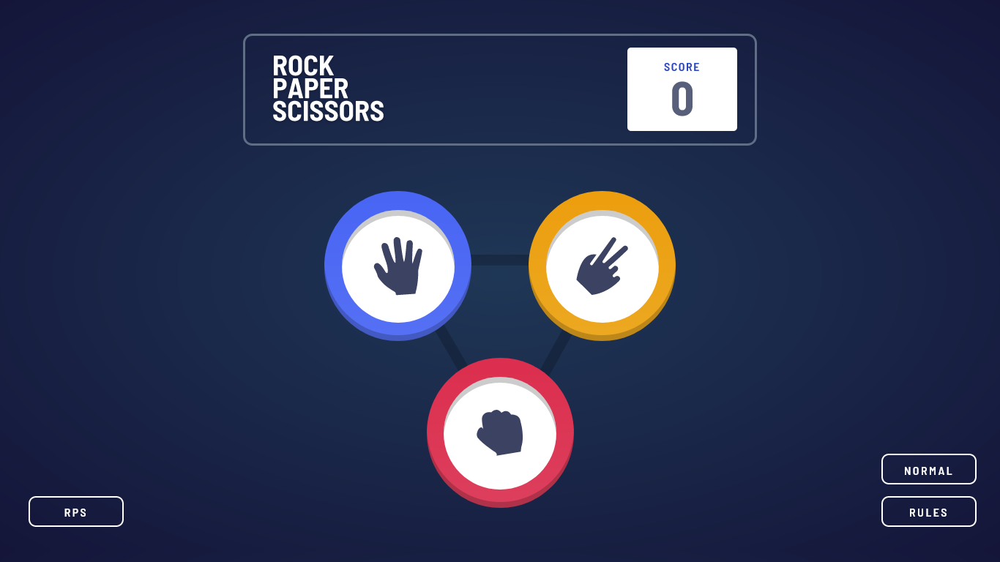

# Frontend Mentor - Rock, Paper, Scissors solution


This is a solution to the [Rock, Paper, Scissors challenge on Frontend Mentor](https://www.frontendmentor.io/challenges/rock-paper-scissors-game-pTgwgvgH). Frontend Mentor challenges help you improve your coding skills by building realistic projects. 

---
## Table of contents

- [Frontend Mentor - Rock, Paper, Scissors solution](#frontend-mentor---rock-paper-scissors-solution)
  - [Table of contents](#table-of-contents)
  - [Overview](#overview)
    - [The challenge](#the-challenge)
    - [Screenshot](#screenshot)
    - [Links](#links)
  - [My process](#my-process)
    - [Built with](#built-with)
    - [What I learned](#what-i-learned)
    - [Continued development](#continued-development)
    - [Useful resources](#useful-resources)
  - [Author](#author)
  - [Acknowledgments](#acknowledgments)

---

## Overview
Greetings Everyone! This project is made for the purpose of practicing and improving my CSS skills. 
This challenge is setup by [`Frontend Mentor`](https://www.frontendmentor.io/challenges/rock-paper-scissors-game-pTgwgvgH). To know more about this challenge, read the *challenge.md*.

### The challenge

Users should be able to:

- View the optimal layout for the game depending on their device's screen size
- Play Rock, Paper, Scissors against the computer
- Maintain the state of the score after refreshing the browser _(optional)_
- **Bonus**: Play Rock, Paper, Scissors, Lizard, Spock against the computer _(optional)_

**`Difficulty:`**` Advanced`

### Screenshot


Screen: `1366x768 desktop`


Screen: `1920x966 desktop`


Screen: `375x750 mobile`


Screen: `1366x768 desktop bonus`


Screen: `1920x966 desktop bonus`


Screen: `375x750 mobile bonus`


### Links

- Solution URL: [Github repo url](https://github.com/almoratalla/Rock-Paper-Scissors-Lizard-Spock-game)
- Live Site URL: [My github page](https://almoratalla.github.io/projects/learning/rock-paper-scissors-lizard-spock-game/)

## My process

### Built with

- Semantic HTML5 markup
- SCSS
- Vanilla JavaScript
- Flexbox
- Mobile-first workflow

### What I learned

My major takeaway from this is the problems arising in responsiveness especially when I follow the dimensions of the elements taken from the provided design images. In reference to the style guide, I laid out the designs in 1366 and 375 widths for desktop and mobile respectively while following the design image's corresponding height. When I follow the dimensions strictly for the elements and the amount of spacing per element, responsiveness becomes a challenge. A temporary solution would be to create separate queries for each screens which will fill the gap on these strict dimensions but I think there can be a better approach to this.

The design choice for the html markup would be to try it as semantic as possible. I separated the scoreboard as the `header` element accompanied with a `main` element which will serve as the main play board. On the `main` element, I subdivided it into 3 parts; a `nav` to change the game state, the controls section which is a `div` and an another separate `nav` for the rules and game mode buttons. Whenever the player chooses an option, the controls `div` would be rerendered into `sections`; one for the picking state and another for the results state. 

For styling, I used a boilerplate this boilerplate to reset the html. 

Starting with a mobile-first approach: 

```css
html {
    box-sizing: border-box;
    font-size: 100%;
}

*, *::before, *::after{
    box-sizing: inherit;
}

body {
    margin: 0;
    padding: 0;
    max-height: 100%;
}
```

Then started my way down adding styles starting from the header. I learned from this project that the `header` element tag normally does occupy the top most position of the body and adding a margin to it will cause extra space on top that does not cover the body so I added a margin to it's child instead to make the proper scoreboard.

Since the given designs in the style-guide were created to `375px` and `1366px` for Mobile and Desktop respectively, I added these:

*@For screens* ~ laptop/desktop `1366 x 768`, `1280 x 720` or `1300 x 800` // @For screens , 990px and up
*body above* **`1232px width`** *but not more than* **1200px width and 800px height**
```css
@media only screen and (min-width: 992px) and (max-height: 50em){
...
}
```

*@For screens* `1920 x 1080` 
*body* `1920px X 1076px/937px` *or* `120rem x 67.25rem/58.6rem`
```css
@media screen and (min-width: 75em) and (min-height: 50em){
...
}
```


For the script in rendering the DOM, I initially chose to use React but instead used Vanilla JavaScript in rendering the page since it will only take small amount of logic for this mini project. One key takeaway from here is I rerender every DOM element that needs to be updated and removes elements that are needed on the screen dynamically.

Also, I added optional features in this project such as the `rock-paper-scissors-lizard-spock` game as a bonus and a `hard-mode` that uses [Brain.js](https://brain.js.org/#/) to simulate an AI that will detect the user's pattern in order to win. This is also inspired by an example provided on brain.js page. (Link provided in useful resources)


Lastly, for sizes relative to the original design, I estimated the sizes by pasting the `jpg` file into AdobeXD and eyeballed its dimensions. 

### Continued development

Continued development for this is to improve responsiveness, be it on media queries or relative dimensions on some elements. Also it would be fun to add other features on this such as adding voice/image recognition when you play the game or maybe even improving the AI. 

### Useful resources

- [Frontendmentor.io](https://www.frontendmentor.io/resources) - Frontendmentor itself has a list of great resources!.
- [MDN Web Docs](https://developer.mozilla.org/en-US/docs/Web/CSS/Reference) - Great reference for syntax and properties.
- [CSS Tricks!](https://css-tricks.com/snippets/css/a-guide-to-flexbox/) - Something I go back to as a reference for flexbox.
- [Google Everything](https://www.google.com/) - You don't know something? Google it! Or any search engine that you prefer. I just mainly use it to go to Stack Overflow lol
- [Stack Overflow](https://stackoverflow.com/) - the ever loving and benevolent!
- [Brain.js](https://brain.js.org/#/examples) - simple neural network library for browser. I love this
- [The rock paper scissors with AI sample](https://github.com/arifikhsan/batu-gunting-kertas-nuxt) - I used this as an inspiration in writing the hard mode.

## Author

- Website - [Alain Moratalla](https://github.com/almoratalla)
- Frontend Mentor - [@almoratalla](https://www.frontendmentor.io/profile/almoratalla)
- Twitter - [@almoratalla](https://twitter.com/almoratalla)

## Acknowledgments

I tip all the hats in the world for FrontEnd Mentor for giving these challenges. Also, I would like to thank the people I shared this game demo, they are who really made this better.